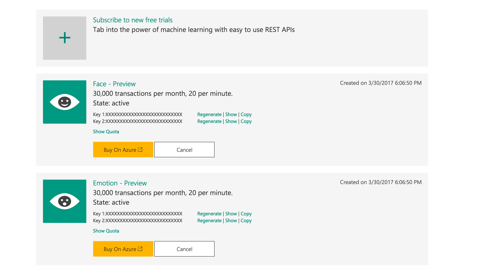

# Ejercicio de Xamarin & Microsoft Cognitive Services

## Requisitos

Para poder realizar este ejercicio es necesario contar o crear una cuenta de Microsoft Cognitive Services puedes generarla directamente [aqui](https://www.microsoft.com/cognitive-services/)

## Subscribirte a Cognitive Services

En la pagina principal vamos a la seccion "My Account"

Nota: Recibiremos un correo de confimarcion de nuestra cuenta.

Una vez dentro de nuestro perfil podremos activar los servicios que requiramos dando click en el boton de añadir.

En la siguiente pantalla podremos activar tantos servicios como necesitemos ademas de poder cada uno de los detalles y costos.

Despues de aceptar los terminos regresamos a la pagina de perfil en el cual podremos encontrar las credenciales para acceder a la API que eligimos.

